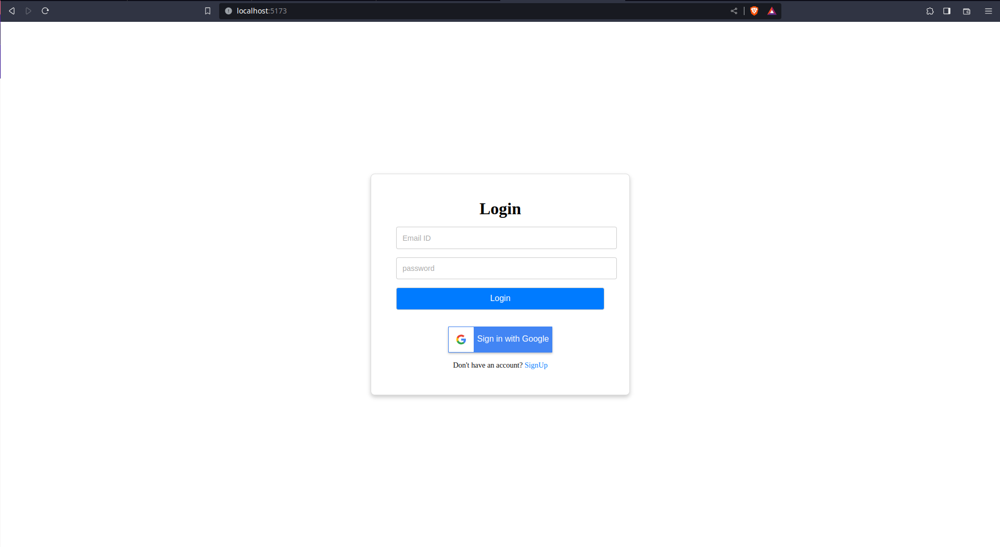
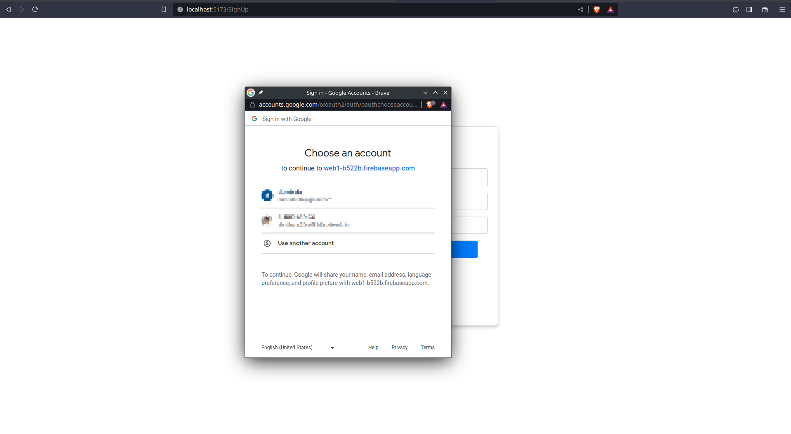
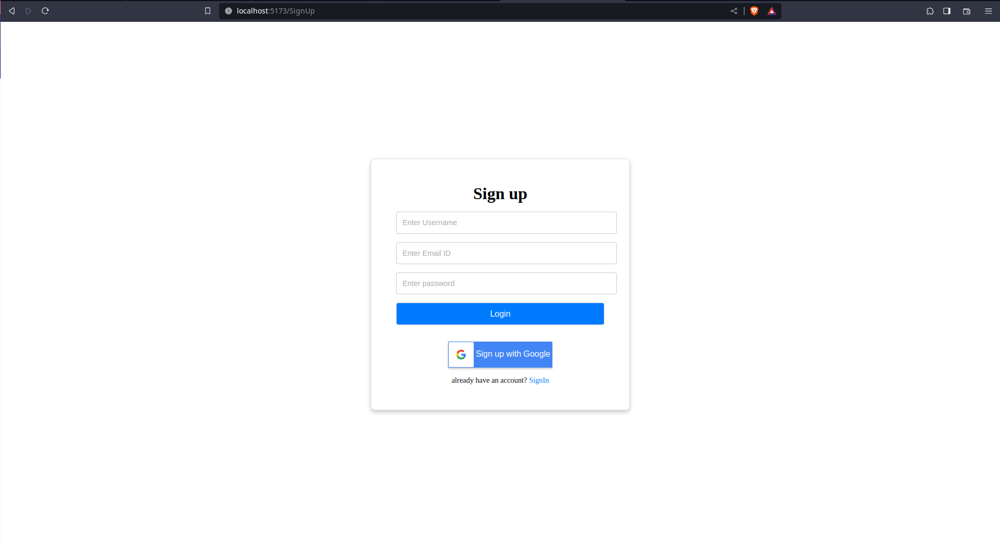
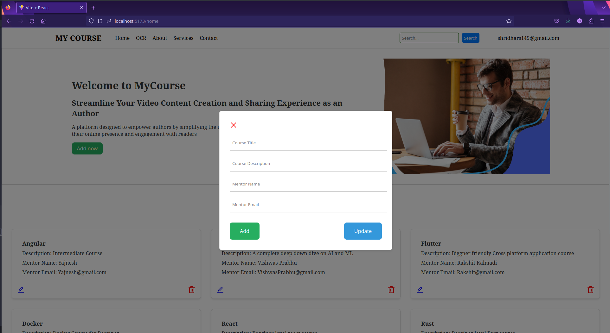
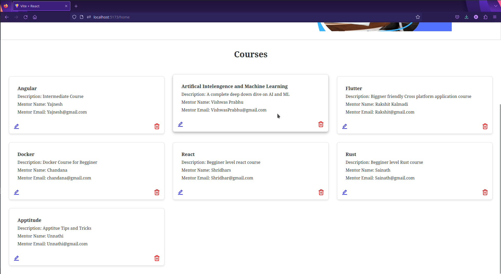
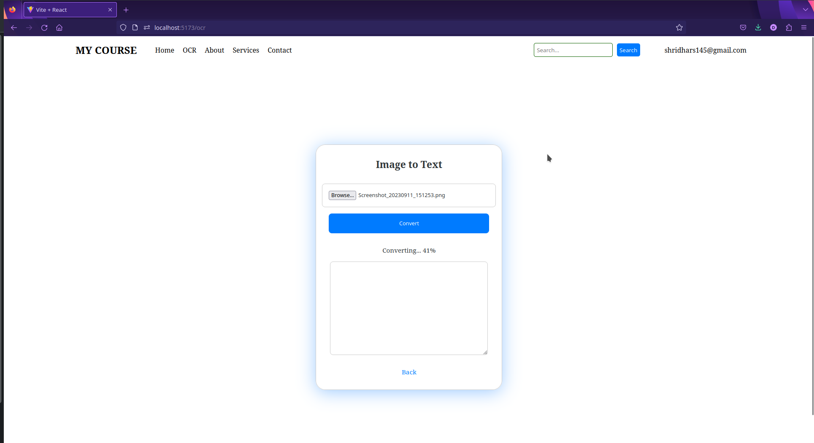
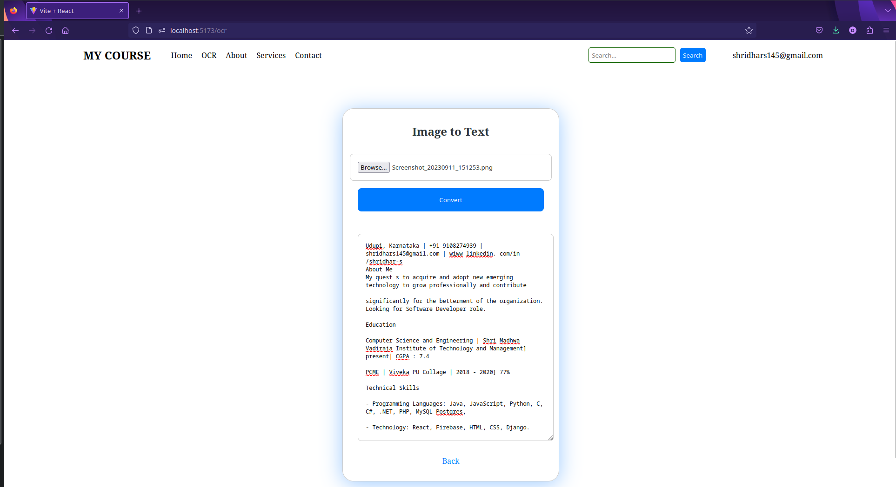

# React + Vite

This template provides a minimal setup to get React working in Vite with HMR and some ESLint rules.

Currently, two official plugins are available:

- [@vitejs/plugin-react](https://github.com/vitejs/vite-plugin-react/blob/main/packages/plugin-react/README.md) uses [Babel](https://babeljs.io/) for Fast Refresh
- [@vitejs/plugin-react-swc](https://github.com/vitejs/vite-plugin-react-swc) uses [SWC](https://swc.rs/) for Fast Refresh

fireabse link

# React Project Configuration with Vite

This document provides step-by-step instructions on how to configure a React project using the Vite build tool. Vite is a fast and lightweight development tool that makes it easy to set up modern web projects.

## Prerequisites

Before you begin, make sure you have the following prerequisites installed on your machine:

- [Node.js](https://nodejs.org/) (v12 or higher)  
- [npm](https://www.npmjs.com/) or [Yarn](https://yarnpkg.com/) package manager (Yarn is recommended)

## Getting Started  

1. **Create a New React Project**

   To create a new React project with Vite, you can use the following command:

   ```
   npx create-react-app my-vite-react-app
   ```

   Replace `my-vite-react-app` with your desired project name.  

2. **Navigate to Your Project Folder**

   Change your current directory to the newly created project folder:

   ```
   cd my-vite-react-app
   ```
3. **Install Dependencies**

   Vite requires some additional dependencies to work with React. Install them using npm or Yarn:

   ```bash
   # Using npm
   npm install --save react react-dom

   # Using Yarn
   yarn add react react-dom
   ```

4. **Install Vite**

   You need to install Vite as a development dependency in your project:

   ```bash
   # Using npm
   npm install --save-dev vite

   # Using Yarn
   yarn add -D vite
   ```

5. **Create Vite Configuration**

   Create a `vite.config.js` file in the root of your project and configure it for React:

   ```javascript
   // vite.config.js
   import { defineConfig } from 'vite';
   import react from '@vitejs/plugin-react';

   export default defineConfig({
     plugins: [react()],
   });
   ```

6. **Update Scripts**

   In your `package.json` file, update the scripts to use Vite instead of the default React scripts. Replace the `"scripts"` section with the following:

   ```json
   "scripts": {
     "start": "vite",
     "build": "vite build",
     "test": "vite test",
     "eject": "react-scripts eject"
   }
   ```

7. **Start the Development Server**

   You can now start the development server with the following command:

   ```bash
   npm run start
   # Or, if you're using Yarn
   yarn start
   ```

   This will launch your React project with Vite. You can access it in your web browser at `http://localhost:3000`.

## Building for Production

To build your React project for production, you can run the following command:

```bash
npm run build
# Or, if you're using Yarn
yarn build
```

This will generate a production-ready build of your project in the `dist` folder.

That's it! You've successfully configured a React project with Vite. Happy coding!


You can save this content in a `.md` file (e.g., `README.md`) in your project directory.


## Application state

# Project Screenshots

<!--
Login Page section:

Shows sample screenshots of the login page with different login options like email/password, Google login etc. 

Includes the following screenshot images:

- Login_Page.png - Shows login screen with email/password and Google login buttons
- GoogleLogin.png - Shows Google account selection popup for login  
- SignUp_page.png - Shows signup form to create a new account
-->

## Login Page

Bunch of options to choose from






<!--
SignUp page section:

Includes SignUp_page.png screenshot showing the signup form with fields like name, email, password etc. 
-->

## SignUp page




<!--
Home Page section: 

Includes Courses.png screenshot showing the homepage with available courses listed.
-->

# Task 2
## CRUD Page






<!--
OCR application section:

Includes OCR.png screenshot showing the OCR input form. 
-->

# Task 3
## OCR application




<!-- 
OCR after uploading image section:

Includes OCR_After.png screenshot showing OCR output text after uploading an image.
-->

## OCR after uploading image




